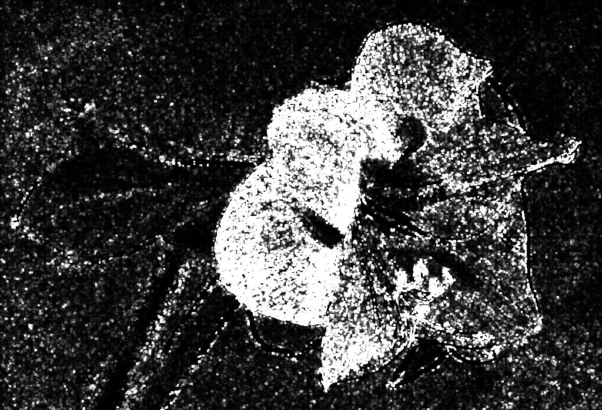
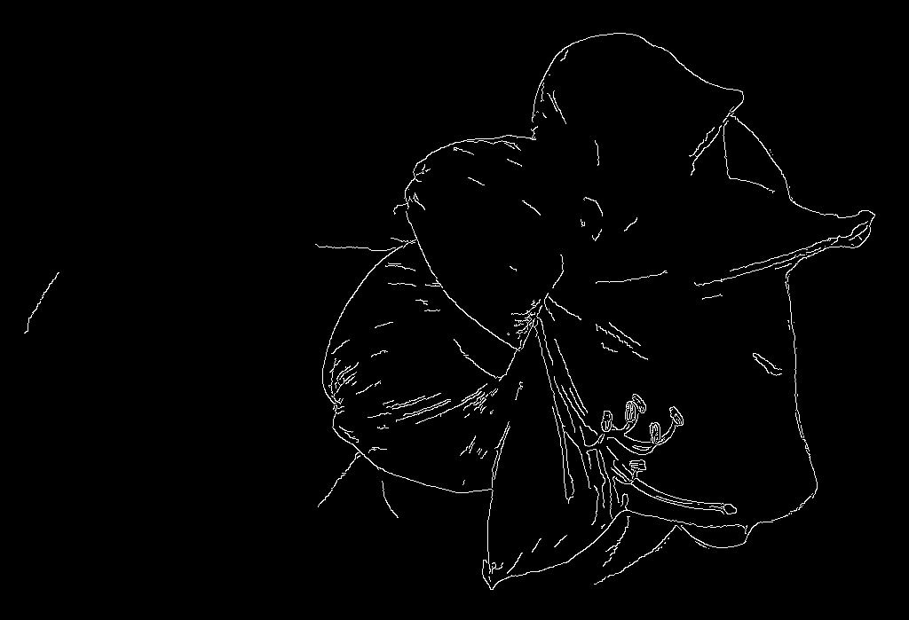
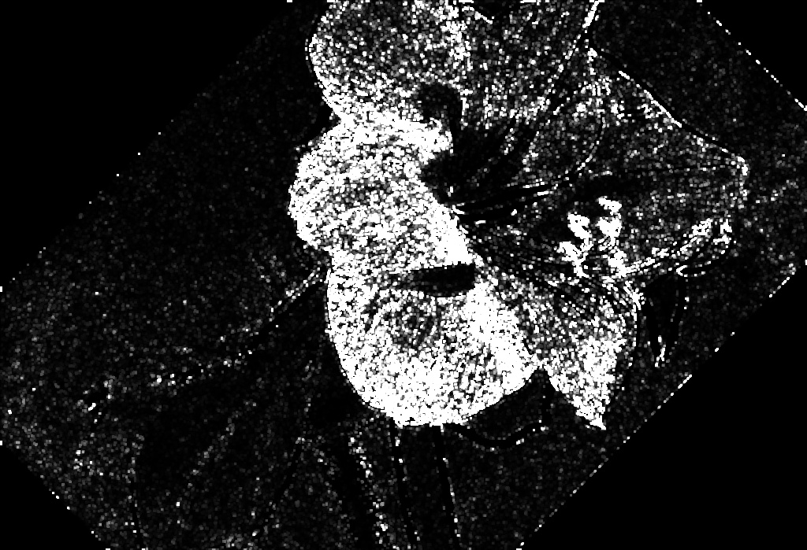
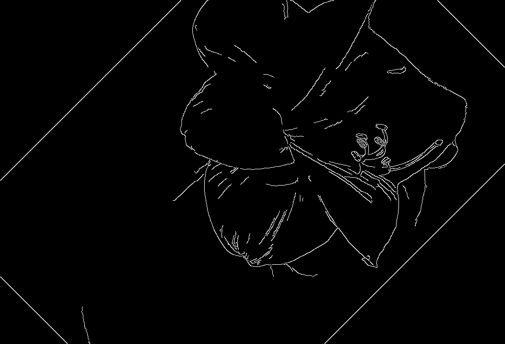
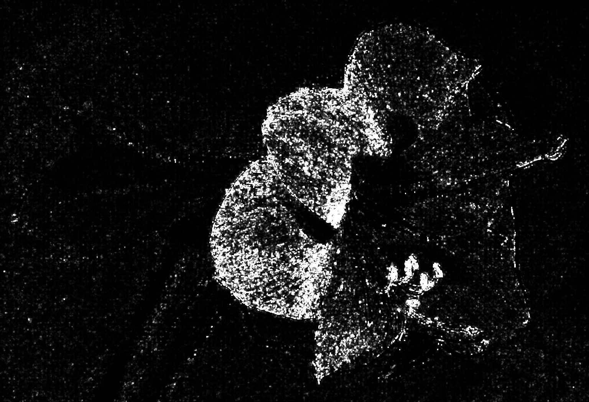
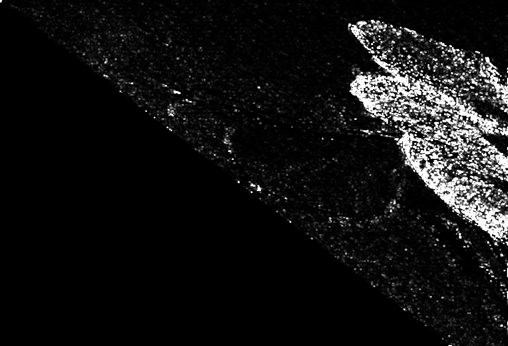
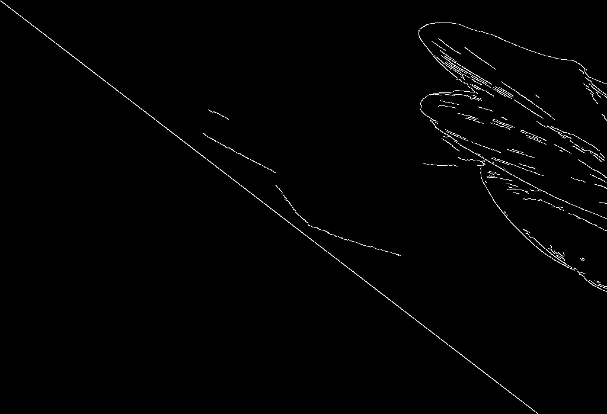

Below questions pertain to the image (flower.jpg) available in the 'HW6' folder of 'files'.

1) Run an in-built edge detector and a corner detector, produce 2 output images
    
    1. image with edges
    2. image with corners

2) Rotate the original image by 45-degrees and perform (1)

3) Scale the original image by 1.5 in both the x and y-directions and perform (1)

4) Shear the original image in the x-direction by 1.3 and perform (1)

5) Shear the original image in the y-direction by 1.3 and perform (1)

 

Submit your code and results (total of 10 images). 

Results
---

